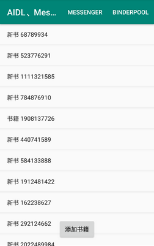
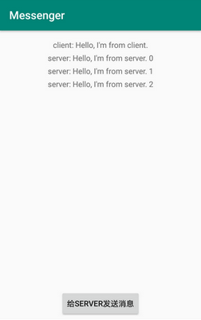
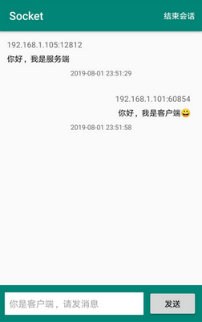

# AndroidSample

Android的一些示例，方便学习研究，其中Samples是主项目，Assist是辅助项目（跨应用操作需要）

## Activity生命周期与启动模式

Activity：A(standard)、B(singleTop)、C(singleTask)、D(singleInstance)

* 从A跳转到B：A.onPause -> B.onCreate -> B.onStart -> B.onResume -> A.onSaveInstanceState -> A.onStop

* 从B返回A：B.onPause -> A.onRestart -> A.onStart -> A.onResume -> B.onStop -> B.onDestroy

* LifecycleOwner与LifecycleObserver的生命周期方法执行顺序：进入的时候LifecycleOwner先于LifecycleObserver执行，而离开的时候相反，LifecycleObserver的onStop会先于LifecycleOwner的onSaveInstanceState执行

* 在B中打开B：onPause -> onNewIntent -> onResume

* 在C中打开A接着再打开C：C.onPause -> A.onCreate -> A.onStart -> A.onResume -> C.onSaveInstanceState -> C.onStop -> A.onPause -> C.onNewIntent -> C.onRestart -> C.onStart -> C.onResume -> A.onStop -> A.onDestroy

* 在A中打开D再打开B然后再按返回键：会回到A，但是D还活着，再打开D会执行：onNewIntent -> onRestart -> onStart -> onResume

* 一般情况下Activity在哪个任务栈中被打开，那么其就处于该任务栈中。但是在设置了singleInstance启动模式的Activity中打开会不一样，singleInstance表示Activity独占一个任务栈，在该Activity中打开的其他Activity会被放在前一个任务栈中

* taskAffinity用来指定任务栈的名字，默认为包名，taskAffinity和singleTask或者allowTaskRearenting属性配对使用

* allowTaskRearenting属性是这样的：假定应用A打开应用B的Activity(allowTaskRearenting属性为ture)，那么该Activity会处于应用B的任务栈中，如果该Activity的allowTaskRearenting属性为false，则会处于应用A的任务栈中。从所处任务栈这一点来看，效果和设置Intent.FLAG_ACTIVITY_NEW_TASK打开该Activity是一样的，区别在按返回键上，allowTaskRearenting属性为ture的Activity按返回键时会自动创建应用的入口Activity，而仅设置Intent.FLAG_ACTIVITY_NEW_TASK的Activity会直接被结束

## AIDL、Messenger、BinderPool

   

* AIDL文件其实只是方便我们写Binder接口而已，用AIDL和Messenger都能进行IPC，AIDL用来RPC，Messenger专注收发消息

* AIDL中用于传输的类要实现Parcelable接口且位于java目录中，还要创建一个同名的aidl文件（用于映射传输类）位于aidl资源目录中，两个文件得保持一致的包名

* AIDL中使用的aidl文件都得用import导入进来，用到的参数除了基本数据类型都得声明方向（in、out、inout）

* 通常一个Service对应一个AIDL接口，当我们有大量的AIDL接口时就得创建相应数量的Service，这会造成Service资源的浪费，大量的Service也会使应用显得很臃肿。而通过BinderPool就可以使一个Service对应多个AIDL接口，当我们连接服务后只会获得一个IBinder,但是通过这个IBinder可以返回多个IBinder，这样就解决了一个Service对应多个AIDL接口的问题。

## ContentProvider

* ContentProvider也可以实现IPC，主要用来向其他应用提供数据，如通讯录、日程表信息等，在Assist项目中进行了实现

* ContentProvider通过实现query、insert、delete、update方法来进行对数据库的CRUD操作，getType用来返回MIME类型（图片、视频等），call方法可以用来模拟RPC

* query、insert、delete、update方法对Room等ORM框架不太友好，尤其是遇到数据库中ID自动增长需要获取ID的情况，而insert方法返回的是Uri对象。query返回的必须是Cursor对象，可以考虑用call方法以及Gson来实现

* query、insert、delete、update方法可以通过UriMatcher来路由Uri到相应的处理中

* 可以添加android:permission属性来对ContentProvider进行权限控制

## Socket

  

* Socket也是实现IPC的利器，分为UDP与TCP两种类型的Socket

* Socket的输入输出流不再使用了都得进行close，一旦Socket中的某个流被close了整个Socket也会被close，可以使用shutdownOutput和shutdownInput来进行半关闭

* TCP Socket的创建消耗比较大，通信比较频繁的情况可以保持长连接来减少Socket的创建，为了确认服务端与客户端是否处于TCP连接中，两端可以使用心跳检测

* Socket的创建是耗时操作，得放在工作线程中进行

